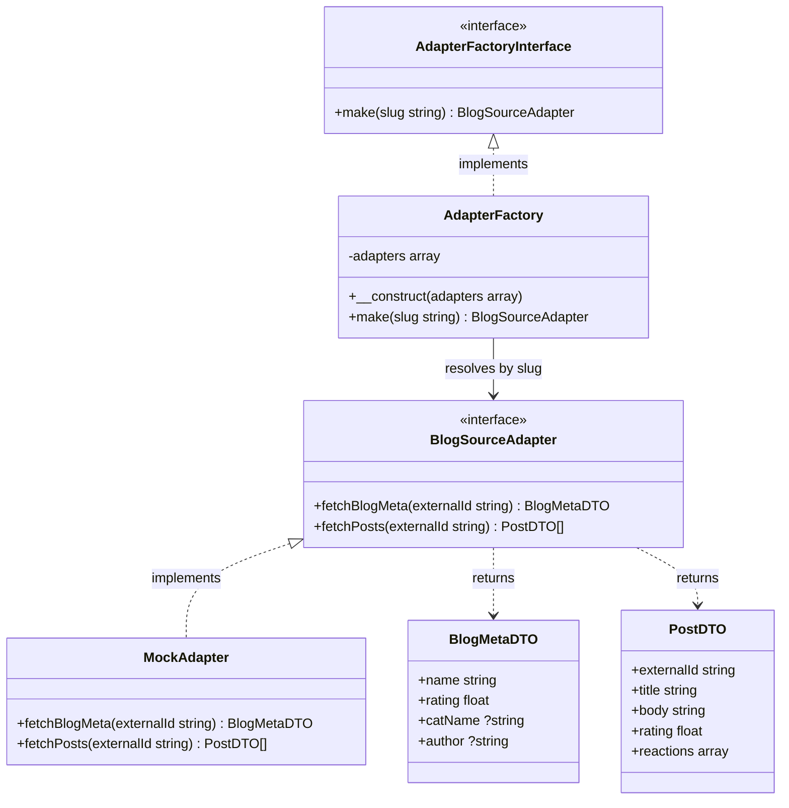
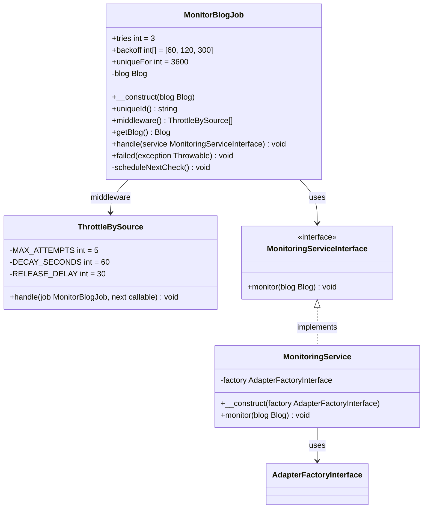
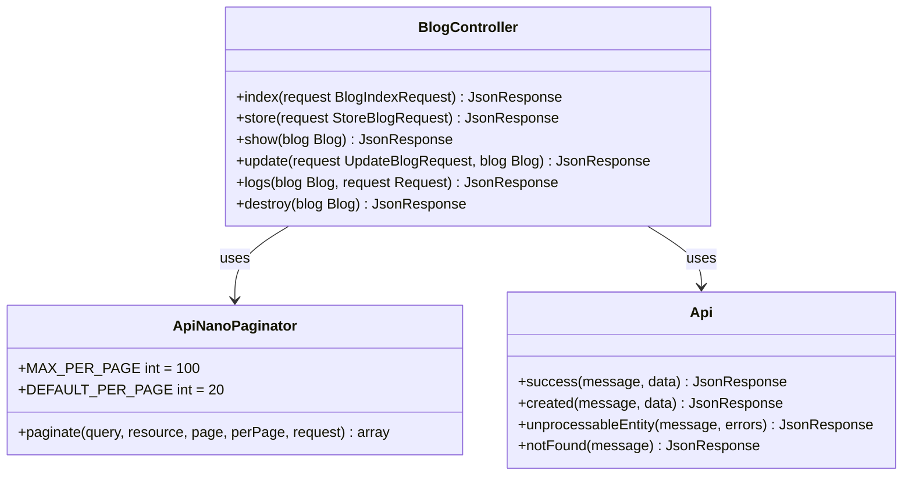

# Диаграмма классов

## Слой адаптеров

```mermaid
classDiagram
    class BlogSourceAdapter {
        <<interface>>
        +fetchBlogMeta(externalId string) BlogMetaDTO
        +fetchPosts(externalId string) PostDTO[]
    }

    class MockAdapter {
        +fetchBlogMeta(externalId string) BlogMetaDTO
        +fetchPosts(externalId string) PostDTO[]
    }

    class AdapterFactoryInterface {
        <<interface>>
        +make(slug string) BlogSourceAdapter
    }

    class AdapterFactory {
        -adapters array
        +__construct(adapters array)
        +make(slug string) BlogSourceAdapter
    }

    class BlogMetaDTO {
        +name string
        +rating float
        +catName ?string
        +author ?string
    }

    class PostDTO {
        +externalId string
        +title string
        +body string
        +rating float
        +reactions array
    }

    BlogSourceAdapter <|.. MockAdapter : implements
    AdapterFactoryInterface <|.. AdapterFactory : implements
    AdapterFactory --> BlogSourceAdapter : resolves by slug
    BlogSourceAdapter ..> BlogMetaDTO : returns
    BlogSourceAdapter ..> PostDTO : returns
```

## Слой задач (Jobs)

```mermaid
classDiagram
    class MonitorBlogJob {
        +tries int = 3
        +backoff int[] = [60, 120, 300]
        +uniqueFor int = 3600
        -blog Blog
        +__construct(blog Blog)
        +uniqueId() string
        +middleware() ThrottleBySource[]
        +getBlog() Blog
        +handle(service MonitoringServiceInterface) void
        +failed(exception Throwable) void
        -scheduleNextCheck() void
    }

    class ThrottleBySource {
        -MAX_ATTEMPTS int = 5
        -DECAY_SECONDS int = 60
        -RELEASE_DELAY int = 30
        +handle(job MonitorBlogJob, next callable) void
    }

    class MonitoringService {
        -factory AdapterFactoryInterface
        +__construct(factory AdapterFactoryInterface)
        +monitor(blog Blog) void
    }

    class MonitoringServiceInterface {
        <<interface>>
        +monitor(blog Blog) void
    }

    MonitoringServiceInterface <|.. MonitoringService : implements
    MonitorBlogJob --> ThrottleBySource : middleware
    MonitorBlogJob --> MonitoringServiceInterface : uses
    MonitoringService --> AdapterFactoryInterface : uses
```

## Слой HTTP

```mermaid
classDiagram
    class BlogController {
        +index(request BlogIndexRequest) JsonResponse
        +store(request StoreBlogRequest) JsonResponse
        +show(blog Blog) JsonResponse
        +update(request UpdateBlogRequest, blog Blog) JsonResponse
        +logs(blog Blog, request Request) JsonResponse
        +destroy(blog Blog) JsonResponse
    }

    class ApiNanoPaginator {
        +MAX_PER_PAGE int = 100
        +DEFAULT_PER_PAGE int = 20
        +paginate(query, resource, page, perPage, request) array
    }

    class Api {
        +success(message, data) JsonResponse
        +created(message, data) JsonResponse
        +unprocessableEntity(message, errors) JsonResponse
        +notFound(message) JsonResponse
    }

    BlogController --> ApiNanoPaginator : uses
    BlogController --> Api : uses
```
