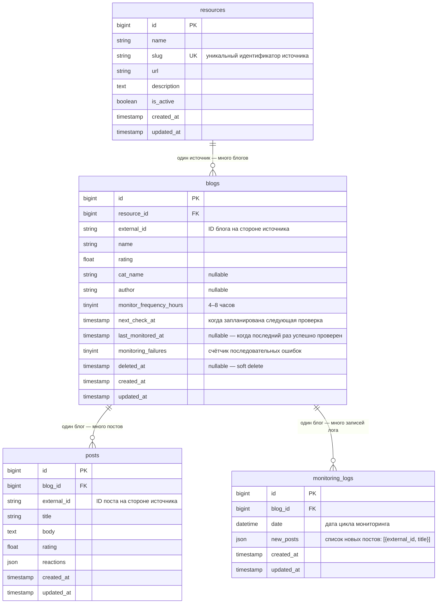

# ER-диаграмма базы данных

## Ключевые решения схемы

| Поле | Причина |
|---|---|
| `next_check_at` | Каждый блог знает, когда его проверить — нет центрального координатора |
| `monitoring_failures` | Счётчик позволяет найти системно падающие блоги без разбора логов |
| `last_monitored_at` | Показывает «мёртвые» блоги, которые давно не мониторились |
| `deleted_at` | Soft delete сохраняет историю `monitoring_logs` после снятия с мониторинга |
| `posts.reactions` | JSON — структура реакций у каждого источника своя |
| `resources.slug` | Уникальный ключ для резолюции адаптера в `AdapterFactory` |
