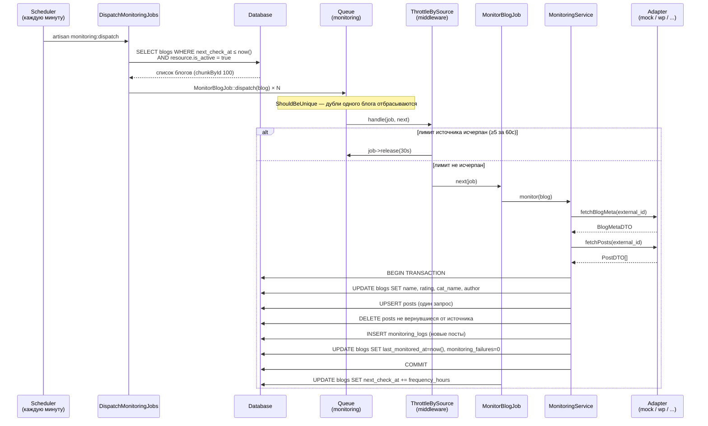
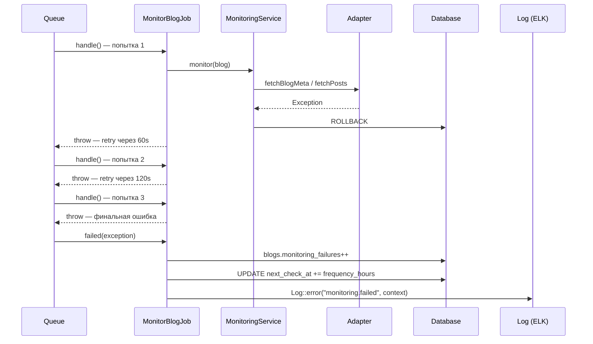
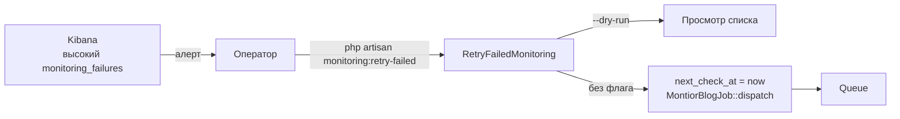

# Поток мониторинга

## Полный цикл — от планировщика до базы данных

```mermaid
sequenceDiagram
    participant S as Scheduler<br/>(каждую минуту)
    participant D as DispatchMonitoringJobs
    participant DB as Database
    participant Q as Queue<br/>(monitoring)
    participant TH as ThrottleBySource<br/>(middleware)
    participant J as MonitorBlogJob
    participant M as MonitoringService
    participant A as Adapter<br/>(mock / wp / ...)

    S->>D: artisan monitoring:dispatch
    D->>DB: SELECT blogs WHERE next_check_at ≤ now()<br/>AND resource.is_active = true
    DB-->>D: список блогов (chunkById 100)
    D->>Q: MonitorBlogJob::dispatch(blog) × N

    Note over Q: ShouldBeUnique — дубли одного блога отбрасываются

    Q->>TH: handle(job, next)
    alt лимит источника исчерпан (≥5 за 60с)
        TH->>Q: job->release(30s)
    else лимит не исчерпан
        TH->>J: next(job)
        J->>M: monitor(blog)

        M->>A: fetchBlogMeta(external_id)
        A-->>M: BlogMetaDTO

        M->>A: fetchPosts(external_id)
        A-->>M: PostDTO[]

        M->>DB: BEGIN TRANSACTION
        M->>DB: UPDATE blogs SET name, rating, cat_name, author
        M->>DB: UPSERT posts (один запрос)
        M->>DB: DELETE posts не вернувшиеся от источника
        M->>DB: INSERT monitoring_logs (новые посты)
        M->>DB: UPDATE blogs SET last_monitored_at=now(), monitoring_failures=0
        M->>DB: COMMIT

        J->>DB: UPDATE blogs SET next_check_at += frequency_hours
    end
```

## Путь при ошибке

```mermaid
sequenceDiagram
    participant Q as Queue
    participant J as MonitorBlogJob
    participant M as MonitoringService
    participant A as Adapter
    participant DB as Database
    participant L as Log (ELK)

    Q->>J: handle() — попытка 1
    J->>M: monitor(blog)
    M->>A: fetchBlogMeta / fetchPosts
    A-->>M: Exception
    M->>DB: ROLLBACK
    J-->>Q: throw — retry через 60s

    Q->>J: handle() — попытка 2
    J-->>Q: throw — retry через 120s

    Q->>J: handle() — попытка 3
    J-->>Q: throw — финальная ошибка

    Q->>J: failed(exception)
    J->>DB: blogs.monitoring_failures++
    J->>DB: UPDATE next_check_at += frequency_hours
    J->>L: Log::error("monitoring.failed", context)
```

## Ручное восстановление (DLQ)

```mermaid
flowchart LR
    K[Kibana\nвысокий monitoring_failures] -->|алерт| O[Оператор]
    O -->|php artisan monitoring:retry-failed| C[RetryFailedMonitoring]
    C -->|--dry-run| P[Просмотр списка]
    C -->|без флага| R[next_check_at = now\nMontiorBlogJob::dispatch]
    R --> Q[Queue]
```
